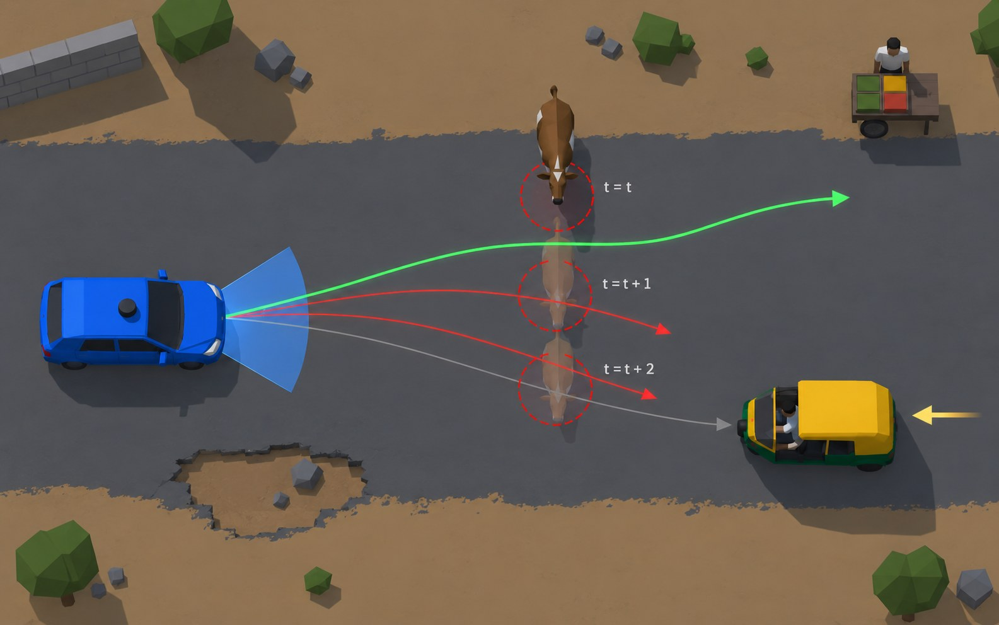
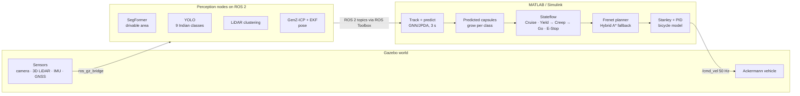

# SAARTHI: Lane-free, prediction-aware autonomy for Indian roads

**Smart India Hackathon 2026 · Problem Statement SIH26037 · Theme: Smart Vehicles**
Team **R.A.A.G.S.Y** (Team ID 163063)

SAARTHI plans around where road users **will be**, not where they are. Perception nodes (fine-tuned YOLO + SegFormer, and LiDAR) see the road. **ROS 2** carries their output to **MATLAB/Simulink**, which tracks, predicts, decides, plans and controls the vehicle, with no lane markings and no HD map.


*Predicted cow positions at t, t+1, t+2: paths that meet a future position are rejected; the green path is chosen.*

---

## Where this repo stands (read this first)

This repository started as our **ROS 2 + Nav2** rover stack: a Gazebo simulation, LiDAR odometry, EKF localisation, Nav2 with a Regulated Pure Pursuit controller, and a MAVROS bridge to a Cube Orange. We used that stack for our first simulation runs and our limited on-vehicle tests.

For SIH26037 we have **moved planning, decision-making and control to MATLAB/Simulink**. The reason is that Nav2's costmap-and-lane assumptions don't fit Indian roads well. We want to plan against *predicted* agent positions, with explicit Indian-road behaviours such as creeping at unsignalised junctions. Stateflow, the Navigation Toolbox and the Sensor Fusion & Tracking Toolbox fit that directly.

So this repo now contains:

| Part | Status |
|---|---|
| Gazebo simulation, sensor bridges, localisation, vehicle interface (ROS 2) | In use: this is the "world" and "body" the Simulink brain talks to |
| Nav2 planning stack (`legacy_nav2/`) | **Legacy baseline.** Kept for comparison runs (the "no-prediction baseline" in our metrics) and for reference |
| Simulink autonomy models (`simulink/`) | Design and interfaces are frozen; the models are added here as they are finalised |

Nothing in the ROS 2 side has to change when the brain moves: Simulink subscribes and publishes on the same standard topics that Nav2 used.

---

## Architecture



| Layer | Runs in | Key tools |
|---|---|---|
| World + sensors | Gazebo Sim (RoadRunner scenes are drop-in) | `ros_gz_bridge` |
| Perception + localisation | ROS 2 nodes | YOLO, SegFormer (fine-tuned on IDD), LiDAR clustering, GenZ-ICP, `robot_localization` |
| Tracking + prediction | Simulink | Sensor Fusion & Tracking Toolbox (`trackerGNN` / `trackerJPDA`) |
| Decision | Simulink | Stateflow |
| Planning | Simulink | Navigation Toolbox (`trajectoryOptimalFrenet`, `plannerHybridAStar`, `dynamicCapsuleList`) |
| Control | Simulink | Automated Driving Toolbox (Stanley), PID, bicycle model |
| Vehicle | Gazebo / Cube Orange via MAVROS | `lirovo`, `converter` |

---

## Repository layout

```
SAARTHI-SIH26037/
├── simulink/                      Simulink autonomy: interface spec + models (in progress)
├── ros2_ws/src/
│   ├── simulation/bcr_bot/        Gazebo vehicle, worlds, launch files
│   ├── perception_localisation/   GenZ-ICP, VINS-Fusion, robot_localization, slam_toolbox,
│   │                              pointcloud_to_laserscan
│   ├── vehicle_interface/         lirovo (MAVROS bridge, watchdog, mission manager),
│   │                              converter + cmd_vel_tester (cmd_vel → Cube Orange PWM)
│   └── legacy_nav2/               navigation2 + target_explorer (Nav2 baseline)
├── tools/                         helper scripts (GenZ-ICP covariance tuning)
└── docs/
    ├── hardware_bringup.md        step-by-step test-rover bring-up
    └── images/
```

---

## Quick start (simulation)

Tested on Ubuntu with ROS 2 Humble; the custom packages also build on Jazzy.

```bash
git clone https://github.com/GurveshSingh/SAARTHI-SIH26037.git
cd SAARTHI-SIH26037/ros2_ws
rosdep install --from-paths src --ignore-src -r -y
colcon build --symlink-install
source install/setup.bash

# 1. Start the Gazebo world and vehicle
ros2 launch bcr_bot gz.launch.py

# 2. Localisation (LiDAR odometry + EKF)
ros2 launch lirovo lirovo.launch.py
```

**Connect Simulink** (MATLAB R2024a+ with ROS Toolbox):

```matlab
setenv("ROS_DOMAIN_ID", "0")   % match the ROS 2 side
ros2 topic list                % you should see /odom, /points, /cmd_vel ...
```

Then open the model in `simulink/`, which subscribes to the perception and odometry topics and publishes `/cmd_vel`. See [`simulink/README.md`](simulink/README.md) for the exact interface.

**Run the legacy Nav2 baseline** (for comparison runs):

```bash
ros2 launch bcr_bot nav2.launch.py
```

**On the real test rover:** follow [`docs/hardware_bringup.md`](docs/hardware_bringup.md).

---

## Progress

| Step | Status |
|---|---|
| POC 1–3: Simulink ↔ ROS 2 ↔ Gazebo link | Done |
| POC 4: static autonomy in simulation | Done |
| POC 5: dynamic agents in simulation | Done |
| POC 6: full scenario loop in simulation | Done |
| Denser dynamic traffic in simulation | Next |
| Hardware: static obstacles | Partial (limited on-vehicle tests) |
| Hardware: dynamic obstacles | Next |
| **Goal:** all target metrics met in finalised RoadRunner scenes | Goal |

### Target metrics (to be replaced by measured values)

| Metric | Target |
|---|---|
| Collisions over 150 randomised runs (5 scenarios × 30 seeds) | 0 |
| Replanning latency, p95 | ≤ 100 ms |
| Scenario completion | ≥ 95% |
| Prediction ADE / FDE at 3 s | ≤ 0.8 m / 1.6 m |
| RMS jerk | ≤ 1.5 m/s³ |
| Min time-to-collision · clearance to pedestrians | ≥ 1.5 s · ≥ 1.0 m |

### Validation scenarios
Unmarked village road · unsignalised junction · highway merge with slow trucks · dense market with mixed traffic · sudden cattle crossing.

---

## Hardware

- **Test rover used so far:** Cube Orange (ArduRover) via MAVROS, 3D LiDAR, IMU.
- **Testing hardware kit (≈ ₹1.64 L):** Livox Mid-360 3D LiDAR, Intel RealSense D455 RGB-D camera, RTK GNSS, Jetson Orin NX, Cube Orange controller.

The stack is vehicle-independent: any vehicle with this minimum sensor kit and drive-by-wire access can run it.

---

## Credits and licences

Third-party packages are included with their original licences: [navigation2](https://github.com/ros-navigation/navigation2), [slam_toolbox](https://github.com/SteveMacenski/slam_toolbox), [robot_localization](https://github.com/cra-ros-pkg/robot_localization), [GenZ-ICP](https://github.com/cocel-postech/genz-icp), [VINS-Fusion-ROS2](https://github.com/zinuok/VINS-Fusion-ROS2), [pointcloud_to_laserscan](https://github.com/ros-perception/pointcloud_to_laserscan) and [bcr_bot](https://github.com/blackcoffeerobotics/bcr_bot). See the `LICENSE` file inside each package.

The rover packages (`lirovo`, `converter`, `cmd_vel_tester`, `target_explorer`) were written by our team, building on the UAS-DTU rover work.
